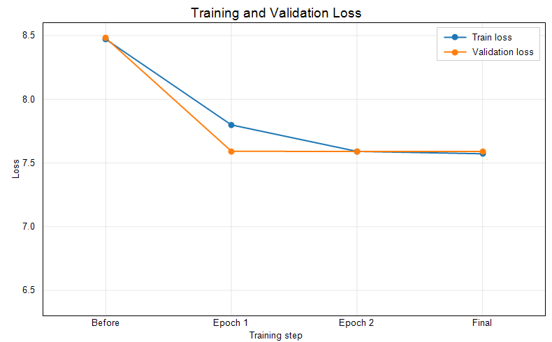
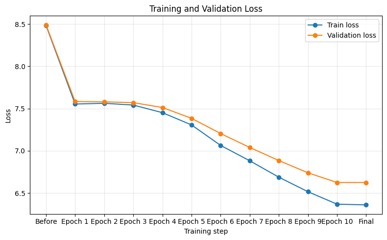
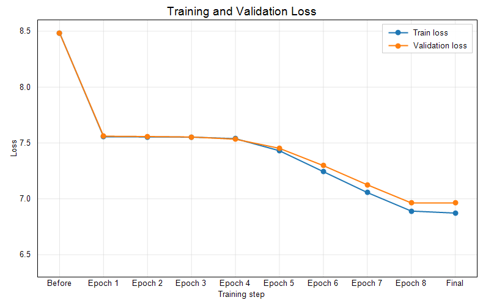

# mini GPT 구현 과제 보고서

## 0. 반·팀원

| 항목  | 내용                 |
| --- | ------------------ |
| 반   | SW-AI 301반         |
| 팀명  | mini GPT 구현팀       |
| 팀원  | 고민석, 나지운, 박건우, 박민석 |

---

## 1. 구현 현황

| 단계  | 구현 내용                                                                          | 구현 파일                                 | 구현  담당자 |
| --- | ------------------------------------------------------------------------------ | ------------------------------------- | ------- |
| 1   | UTF-8 byte-level BPE tokenizer                                                 | `src/bpe.py`                          | 나지운     |
| 2   | GPTDataset, create_dataloader, InputEmbedding                                  | `src/dataset.py`, `src/embeddings.py` | 박민석     |
| 3   | MultiHeadAttention, causal mask                                                | `src/attention.py`                    | 박건우     |
| 4   | LayerNorm, GELU, FeedForward, TransformerBlock, GPTModel, generate_text_simple | `src/model.py`                        | 고민석     |
| 5   | loss 계산, checkpoint, generate, train_model                                     | `src/train.py`                        | 공통      |
| 6   | NSMC 감성 분류 Dataset과 classifier                                                 | `src/finetune.py`                     | 공통      |
	 
---

## 2. 테스트 통과 현황

| 실행 명령                               | 결과  | 비고                                  |
| ----------------------------------- | --- | ----------------------------------- |
| `pytest tests/test_bpe.py -v`       | 통과  | Colab: 6 passed in 0.03s            |
| `pytest tests/test_dataset.py -v`   | 통과  | Colab: 4 passed in 3.44s            |
| `pytest tests/test_attention.py -v` | 통과  | Colab: 2 passed in 1.87s            |
| `pytest tests/test_model.py -v`     | 통과  | Colab: 7 passed in 2.07s            |
| `pytest tests/test_train.py -v`     | 통과  | Colab: 5 passed in 9.87s            |
| `pytest tests/test_finetune.py -v`  | 통과  | Colab: 4 passed in 1.99s            |
| `pytest tests/ -v`                  | 통과  | Colab: 28 passed in 4.12s           |

실패한 테스트가 있다면 에러 요약을 적습니다.

| 실패한 테스트 | 에러 요약 | 해결 시도 |
| --- | --- | --- |
| 없음 | Colab 전체 테스트 28개 모두 통과 | 해당 없음 |

---

## 3. 데이터

| 항목         | 내용                                                                                                   |
| ---------- | ---------------------------------------------------------------------------------------------------- |
| 원본 데이터     | NSMC                                                                                                 |
| 원본 경로      | `data/ratings_train.txt`, `data/ratings_test.txt`                                                    |
| 사전 학습 데이터  | `data/nsmc_lm_train.txt`, `data/nsmc_lm_val.txt`                                                     |
| 미세 조정 데이터  | `data/nsmc_sentiment_train.jsonl`, `data/nsmc_sentiment_val.jsonl`, `data/nsmc_sentiment_test.jsonl` |
| 전처리 방식     | 빈 리뷰 제거, 공백 정리, train/validation 분리                                                                  |
| 사용한 데이터 크기 | 미사용: 현재 `data/.gitkeep`만 존재하고 NSMC 데이터 미다운로드                                                         |

---

## 4. BPE

| 항목               | 내용                                                                                                  |
| ---------------- | --------------------------------------------------------------------------------------------------- |
| 구현 파일            | `src/bpe.py`                                                                                        |
| BPE 방식           | UTF-8 byte-level BPE                                                                                |
| 특수 토큰 ID         | `<pad>=0`, `<unk>=1`, `<bos>=2`, `<eos>=3`                                                          |
| byte token ID 범위 | 4~259                                                                                               |
| vocab_size       | 4096                                                                                                |
| 학습 corpus 크기     | 전체 1,379,486자 중 1,000,000자 사용                                                                       |
| 어휘 학습 시간         | 1449.67초 (약 24분)                                                                                    |
| merge count      | 3,836                                                                                               |
| vocabulary 저장 경로 | 미저장 또는 별도 저장 필요                                                                                     |
| 인코딩/디코딩 복원 예시    | `decode(encode("이 영화는 좋았다. byte-level BPE test!")) == "이 영화는 좋았다. byte-level BPE test!"`, 토큰 ID 21개 |

---

## 5. 모델 구조

| 항목             | 내용                                                             |
| -------------- | -------------------------------------------------------------- |
| 구현 파일          | `src/model.py`                                                 |
| 전체 구조          | InputEmbedding -> N x TransformerBlock -> LayerNorm -> LM head |
| vocab_size     | 4096                                                           |
| context_length | 64                                                             |
| emb_dim        | 192                                                            |
| n_heads        | 4                                                              |
| n_layers       | 4                                                              |
| drop_rate      | 0.2                                                            |
| qkv_bias       | False                                                          |
| 총 파라미터 수       | 약 3,362,688개                                                   |

---

## 6. 사전 학습

### 6.1 하이퍼파라미터

| 구분  | 항목                    | 값               |
| --- | --------------------- | --------------- |
| 모델  | vocab_size            | **4096**        |
| 모델  | context_length        | **64**          |
| 모델  | emb_dim               | 192             |
| 모델  | n_heads               | 4               |
| 모델  | n_layers              | 4               |
| 모델  | drop_rate             | 0.2             |
| 학습  | corpus_size           | **1,000,000자**  |
| 학습  | batch_size            | 16              |
| 학습  | num_epochs            | **10**          |
| 학습  | eval_freq, eval_iter  | not defined, 20 |
| 학습  | token count           | 540,608         |
| 학습  | train_loader batches  | 475             |
| 학습  | val_loader batches    | 53              |
| 학습  | pretrain elapsed time | 90.31초 (약 2분)   |
| 최적화 | learning_rate         | **0.0001**      |
| 최적화 | weight_decay          | 0.1             |

### 6.2 사전학습 실험 결과 한눈에 보기

총 3개의 사전학습 실험을 비교했다. 기본 실험은 409,600자 corpus로 2 epoch를 학습한 기준 결과이고, 이후 corpus 크기, context length, drop_rate, epoch 수를 조정한 추가 실험을 진행했다.

| 실험      | corpus_size | token count | context_length | drop_rate | learning_rate | epoch |             BPE 시간 |         사전 학습 시간 | 최종 train loss | 최종 validation loss |
| ------- | ----------: | ----------: | -------------: | --------: | ------------: | ----: | -----------------: | ---------------: | ------------: | -----------------: |
| 기본 실험   |    409,600자 |     221,186 |            128 |       0.1 |        0.0003 |     2 | 734.31초<br>(약 12분) |   219.95초 (약 4분) |        7.5724 |             7.5898 |
| 추가 실험 B |  1,000,000자 |     540,608 |             64 |       0.2 |        0.0001 |    10 |   1449.67초 (약 24분) |    90.31초 (약 2분) |        6.3602 |             6.6256 |
| 추가 실험 C |  1,379,486자 |     746,264 |            128 |       0.2 |        0.0001 |     8 |   2841.68초 (약 47분) | 2741.61초 (약 46분) |        6.8729 |             6.9636 |

추가 실험 중에서는 `1,000,000자 / 10 epoch / learning_rate 0.0001` 설정이 가장 낮은 validation loss를 기록했다. 다만 실험마다 corpus 크기, context length, drop_rate, epoch가 함께 달라졌기 때문에 특정 요인 하나만의 효과로 단정하기는 어렵다.

### 6.3 사전학습 실험별 그래프와 생성 샘플

#### 기본 실험: 409,600자, 2 epoch

| 구분              | train loss | validation loss |
| --------------- | ---------: | --------------: |
| Before Training |     8.4707 |          8.4798 |
| epoch 1/2       |     7.7986 |          7.5923 |
| epoch 2/2       |     7.5909 |          7.5898 |
| Final Result    |     7.5724 |          7.5898 |

손실 그래프:



생성 샘플: 미생성

#### 추가 실험 B: 1,000,000자, 10 epoch

| 구분 | train loss | validation loss |
| --- | ---: | ---: |
| Before Training | 8.4833 | 8.4904 |
| epoch 1/10 | 7.5535 | 7.5830 |
| epoch 2/10 | 7.5623 | 7.5793 |
| epoch 3/10 | 7.5413 | 7.5701 |
| epoch 4/10 | 7.4516 | 7.5123 |
| epoch 5/10 | 7.3065 | 7.3844 |
| epoch 6/10 | 7.0640 | 7.2044 |
| epoch 7/10 | 6.8826 | 7.0398 |
| epoch 8/10 | 6.6881 | 6.8849 |
| epoch 9/10 | 6.5167 | 6.7401 |
| epoch 10/10 | 6.3691 | 6.6256 |
| Final Result | 6.3602 | 6.6256 |

손실 그래프:




생성 샘플:

```text
이 영화는 좋았지만 그립�리만 지과 사고 이런 사람에서 한것가 좋었으면 좋다
진짜도 지난게 느껴보시길의 현실이 정말 이런 작품에 이젠.. 감동은 드라마! 좋고 감동을것 같어, OST함...
정말 재미있습니다.
1분의 이영화가 재밌어서 지면 한거의 진에 살면서 본 모습과 어머니.
```

#### 추가 실험 C: 전체 corpus, 8 epoch

| 구분 | train loss | validation loss |
| --- | ---: | ---: |
| Before Training | 8.4844 | 8.4825 |
| epoch 1/8 | 7.5556 | 7.5605 |
| epoch 2/8 | 7.5539 | 7.5575 |
| epoch 3/8 | 7.5525 | 7.5534 |
| epoch 4/8 | 7.5384 | 7.5337 |
| epoch 5/8 | 7.4306 | 7.4522 |
| epoch 6/8 | 7.2432 | 7.2973 |
| epoch 7/8 | 7.0563 | 7.1256 |
| epoch 8/8 | 6.8908 | 6.9636 |
| Final Result | 6.8729 | 6.9636 |

손실 그래프:



생성 샘플:

```text
이 영화는 이런 것, �를 비다요에 보다는 이�었다.. 봤는데 오다.
한국
재미없다
역시 다지컬하다너무 아니네요. 아리네..너무...김을 잘 표현...
15였다 너무 좋아은 한음? 이
마지막 보었다.
이건 재밌다. 이러한 배우.
진짜 이런 아나
일본아라가
유치을 다
```

#### 사전학습 실험 해석

- 추가 실험 B는 1,000,000자 corpus와 10 epoch 학습으로 validation loss 6.6256을 기록해 가장 낮은 validation loss를 보였다.
- 추가 실험 C는 전체 corpus를 사용했지만 validation loss는 6.9636으로 추가 실험 B보다 높았다. corpus 크기뿐 아니라 context_length, drop_rate, epoch, 학습 시간 조건이 함께 달라졌기 때문에 직접적인 단일 원인 비교는 어렵다.
- 전반적으로 epoch가 충분히 누적된 실험에서 loss가 더 크게 감소했으며, 생성 샘플도 짧은 학습보다 한국어 리뷰 문장 형태에 가까워지는 경향을 보였다.


---

## 7. 미세 조정

| 항목                         | 내용                         |
| -------------------------- | -------------------------- |
| 구현 파일                      | `src/finetune.py`          |
| 과제                         | NSMC 리뷰 긍정/부정 분류           |
| 데이터 포맷                     | JSONL, `text`, `label`     |
| 사전학습 기준                    | 추가 실험 B: 1,000,000자 / 10 epoch / lr 0.0001 |
| 사전학습 최종 loss                | train 6.3602 / validation 6.6256 |
| max_length                 | 64                         |
| batch_size                 | 16                         |
| 구현 상태                      | 실행 완료                      |
| backbone learning rate     | 1e-05                      |
| classifier learning rate   | 0.0001                     |
| validation loss / accuracy | 0.6919095640182495 / 0.525 |
| test loss / accuracy       | 0.6951846466064453 / 0.492 |
| 미세 조정 소요 시간                | 452.68초 (약 8분)           |
| 오류 예시                      | 미측정                        |

---

## 8. 실험 환경

| 항목         | 내용                                        |
| ---------- | ----------------------------------------- |
| Python     | Colab Python 3.12.13                      |
| PyTorch    | PyTorch 2.11.0+cu128                      |
| 실행 환경      | Colab GPU                                 |
| GPU/CPU 정보 | Tesla T4, CUDA 사용 가능                      |
| 총 학습 소요 시간 | BPE 1449.67초 (약 24분), 사전 학습 90.31초 (약 2분), 미세 조정 452.68초 (약 8분) |
|            |                                           |

---

## 9. 고찰

- 구현에서 배운 점: 이번 과제는 외부 pretrained 모델을 가져와 사용하는 방식이 아니라, tokenizer, dataset, embedding, attention, transformer block, loss 계산, 학습 루프, fine-tuning까지 직접 연결하는 흐름이었다. 이를 통해 GPT가 단순히 하나의 모델 파일이 아니라, 텍스트를 token id로 바꾸고, embedding vector로 변환한 뒤, attention과 transformer block을 거쳐 다음 token을 예측하도록 학습되는 전체 파이프라인임을 확인했다.
- BPE 구현에서 조심한 점: 한국어는 한 글자가 여러 UTF-8 byte로 표현되기 때문에 단순 문자 단위로 자르면 복원이 깨질 수 있다. 그래서 byte-level BPE 방식으로 encode/decode가 원문을 복원하도록 구현했고, 특수 토큰과 byte token ID 범위를 고정해 테스트에서 일관되게 동작하도록 했다.
- 사전학습 결과 해석: 최종 선택한 실험 B에서 학습 전 train loss는 8.4833, validation loss는 8.4904였고, 10 epoch 학습 후 최종 train loss는 6.3602, validation loss는 6.6256으로 감소했다. 이는 모델이 학습 데이터뿐 아니라 검증 데이터에서도 다음 토큰 예측 능력이 개선되었음을 의미한다.
- 하이퍼파라미터 선택 이유: 실험 B는 vocab_size 4096, corpus_size 1,000,000자, context_length 64, emb_dim 192, n_heads 4, n_layers 4, drop_rate 0.2, batch_size 16, learning_rate 0.0001 설정으로 진행했다. 비교 실험 중 validation loss가 가장 낮았기 때문에 보고서의 BPE, 모델 구조, 하이퍼파라미터 설명은 이 설정을 최종 기준으로 삼았다.
- 한계: validation loss가 train loss보다 높게 유지되므로 아직 일반화 성능이 충분하다고 단정하기는 어렵다. 또한 생성 샘플은 일부 한국어 리뷰 문장 형태를 보이지만, 문맥이 자연스럽게 이어지는 수준까지는 도달하지 못했다. 데이터 규모와 학습 시간이 제한되어 있어 실제 LLM 수준의 언어 능력과는 차이가 크다.
- 다음 개선 방향: 실험 B도 checkpoint를 저장하도록 정리하고, 더 큰 corpus와 안정적인 학습 시간 조건에서 반복 실험을 진행할 필요가 있다. 이후 생성 샘플 품질을 함께 확인하면서 fine-tuning 정확도와 validation loss를 같이 개선하는 방향으로 발전시킬 수 있다.
